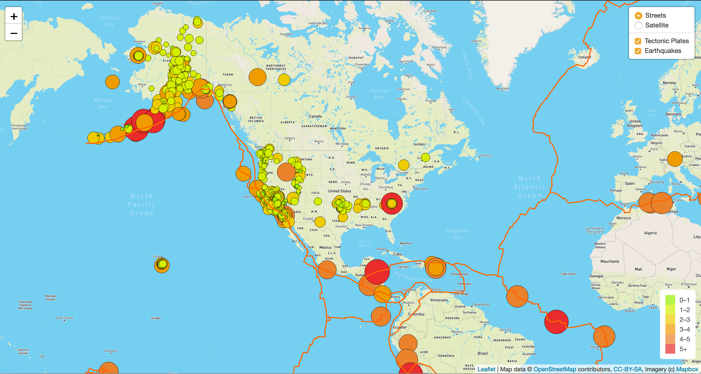
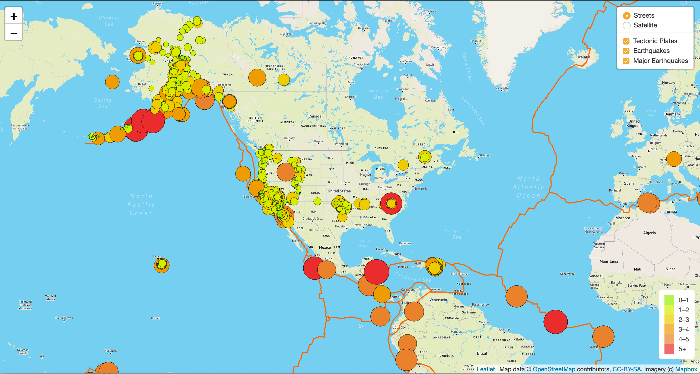
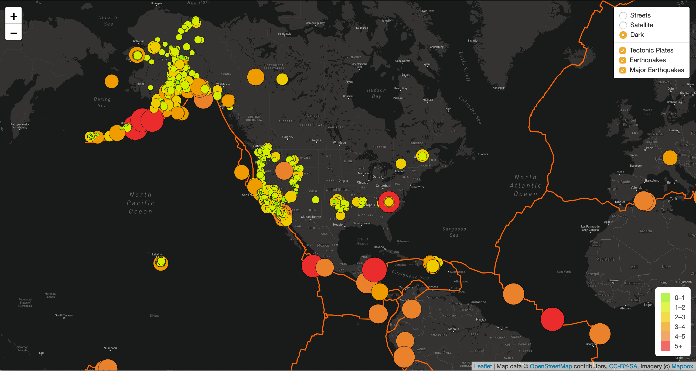

# Detailed Instructions From Your Instructor Team

The objective of this challenge is for you to make additional `d3.json()` API calls and graph tectonic plate data on top of your earthquake data, plot weekly major earthquake data (those that have a magnitude of 4.5 or greater), and add a third map style to your webpage.

## Deliverable 1: Add Tectonic Plate Data
For the first deliverable, we are asking you to make a `d3.json()` call to plot tectonic plate GeoJSON LineString data.  

This task should not be challenging.  However, we have provided the [starter code](../Resources/tectonic_plate_starter_logic.js) to assist you. The starter code contains all the code used to plot the earthquake data on two maps that was covered in this module. you should download the starter code file and rename it `challenge_logic.js`. 

For the tectonic plate data you'll need to:

  * Add a second layer group variable for the tectonic plate data.

  * Add a reference to the tectonic plate data to the overlay object, so the earthquake data and tectonic plate data are selected. 

  * Style the lines with a color and weight that will make it stand out on all maps.

your map should look similar to the following image:

## Deliverable 2: Add Major Earthquake Data 
For this deliverable, we are asking you to add major earthquake data with a magnitude of 4.5 or greater to the map. This data will be populated on the map in additon to all the weekly earthquake data and the tectonic plate data. 

This task should not be that challenging, however, you'll have to copy and refactor some of the code used to plot the weekly earthquake data. To help you we have provided [starter code](../Resources/major_eq_starter_logic.js)
The starter code contains all the code used to plot the earthquake data on two maps in this module. 

you should follow the instructions in Canvas that refer to the steps in the starter code and make the changes to your `challenge_logic.js` file for this part of the challenge.

For the major earthquake data you'll need to:

  * Add a third layer group variable for the major earthquake data.

  * Add a reference to the major earthquake data to the overlay object, so all the data are selected. 

  * Change the `getColor()` function to use only *three* colors for the following magnitudes; a magnitude less than 4, a magnitude greater than 4, and a magnitude greater than 5.

  * Use the same parameters in the `getRadius()` function.

  * When plotting the major earthquake data you'll need to create a circleMarker that is styled, and has a popup marker that displays the magnitude and location of the earthquake.

your map should look similar to the following image:

## Deliverable 3: Add an Additional Map
For this deliverable, we are asking you to add a third map style to the earthquake map.

This task should not be challenging whereas you have added map styles to the map tile layer. 

Here, you will have to choose which map to use for your map, and make sure that all the earthquake data and tectonic plate data are displayed on the all maps of the webpage.

your map should look similar to the following image:

## Submission

Make sure you upload the following to your GitHub pages repository:

1. The Earthquake_Challenge folder
    * `index.html`
    * static
        * css
            * `style.css`
        * js
            * `challenge_logic.js`

2. A README.md that describes the purpose of the repository.  Although there is no graded written analysis for this challenge, it is encouraged and good practice to add a brief description of your project.

## Grading Rubric

The [Mapping Earthquakes Grading Rubric](../Resources/Module_13_Challenge_Grading_Rubric.pdf) is provided for you to use when grading you' submissions.
